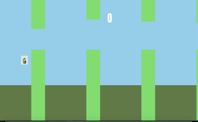

Final Project Proposal – The Flappy Game

I wish to make the Flappy Bird game using Cinder and C++, wherein a player crosses obstacles and earns points. In my game, the player will earn points by moving the object and each object jump will result in one point. The player must move the object more times while navigating through spaces between two pipes to achieve a  high.

The game will display instructions on how to start on the main game screen while their will be a score indicator throughout the game. Once the player hits an obstacle the game will end displaying the score and giving the player instructions on how to play again.

I’m motivated to make this game cause I have been a fan of Flappy bird since very young and was addicted to it at one point. Hence, as flappy bird is now nowhere on the app store, I wished to recreate my own version of it.

This is what the game would look like.

To start the game PRESS ENTER. To Play Again PRESS DELETE. To Jump PRESS SPACE.

Objectives:

•	Week 1: Establishing Game Classes and a basic overview of the functions.

•	Week 2: Designing Sprites, Components and Environment Objects & Enabling Object interaction.

•	Week 3: Implementing Game Logic along with adding finishing touches to the game elements like main menu screen and end game screen.

•	Week 4:  Establishing a Cinder environment and enabling key commands for the game to run.

Stretch Goals:

•	Implement Play audio for an audio to play while the game is going on

•	Create a leader board storing the top 5 high scores

